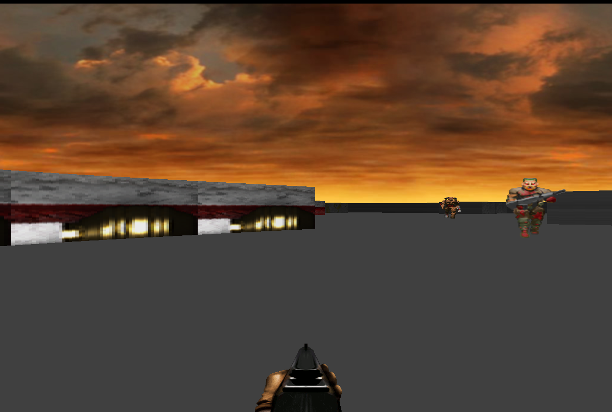

# Raycaster

A raycasting engine inspired by DOOM, written in Rust using SDL3.  
This project is an extension of my [Web-Raycasting-Engine](https://github.com/Euclidae/Web-Raycasting-Engine) based on the Pikuma tutorial.

## Features

- 2.5D raycasting rendering (DOOM/Wolfenstein style)
- Texture-mapped walls, sprites, and weapons
- Basic enemy and player logic
- Extendable map and resource system


## Resources & Credits

- **Assets:**  
  Most resources (textures, sprites, etc.) are from [StanislavPetrovV/DOOM-style-Game](https://github.com/StanislavPetrovV/DOOM-style-Game) ([YouTube video](https://youtu.be/ECqUrT7IdqQ?si=DfzDya6nbGQ54gak)).
- **Tutorial & Guidance:**  
  Dedicated to and helped by Gustavo Pezzi ([Pikuma Raycasting Course](https://pikuma.com/courses/raycasting-engine-tutorial-algorithm-javascript)).
- **Theory & Clarification:**  
  - [Austin Henley's Raycasting Blog](https://austinhenley.com/blog/raycasting.html)
  - [Permadi's Ray Casting Tutorial](https://permadi.com/1996/05/ray-casting-tutorial-1/)

## Getting Started
  Arrow keys for navigation

## TODO
  Fix wall collision. Add enemy ai logic including pathfinding. Potentially game mechanics. N.B on hiatus until I am satisfied
  with progress from Alcides-cpp and Tuneup-rs. 

### Prerequisites

- Rust (edition 2024)
- SDL3 (handled via [sdl3 crate](https://docs.rs/sdl3/latest/sdl3/))

### Build & Run

```sh
cargo run

### Development period 14 - 24 June.